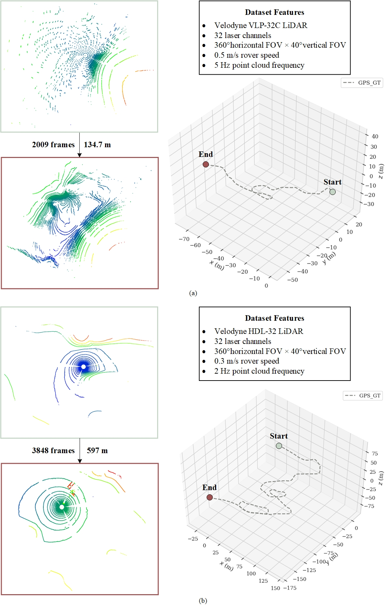
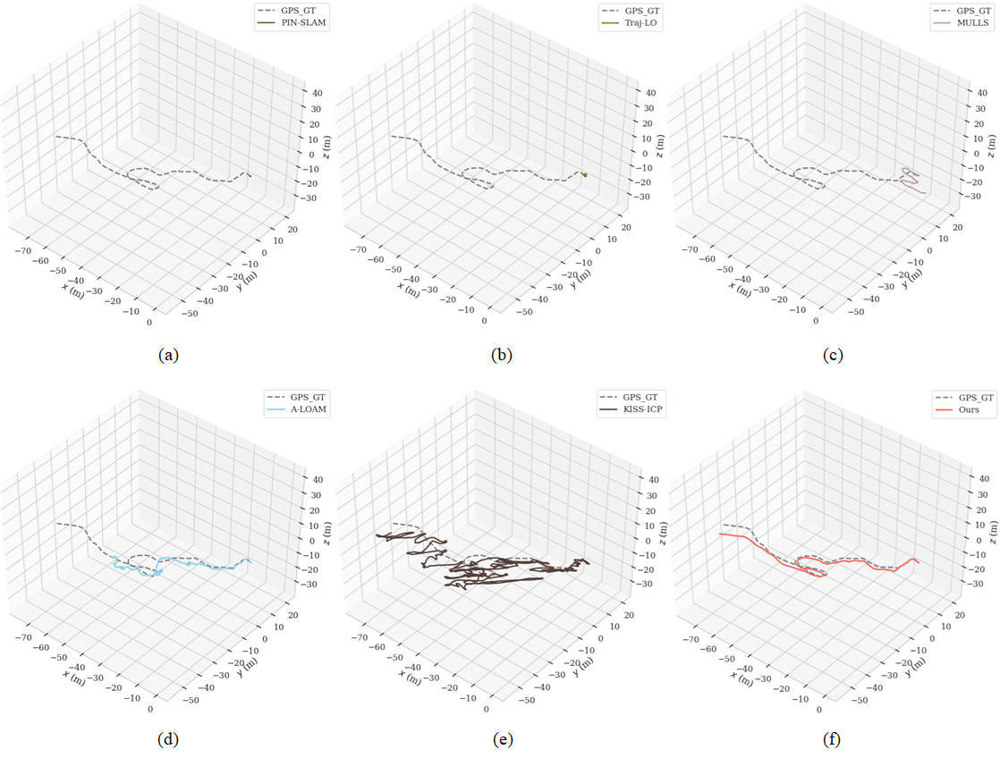
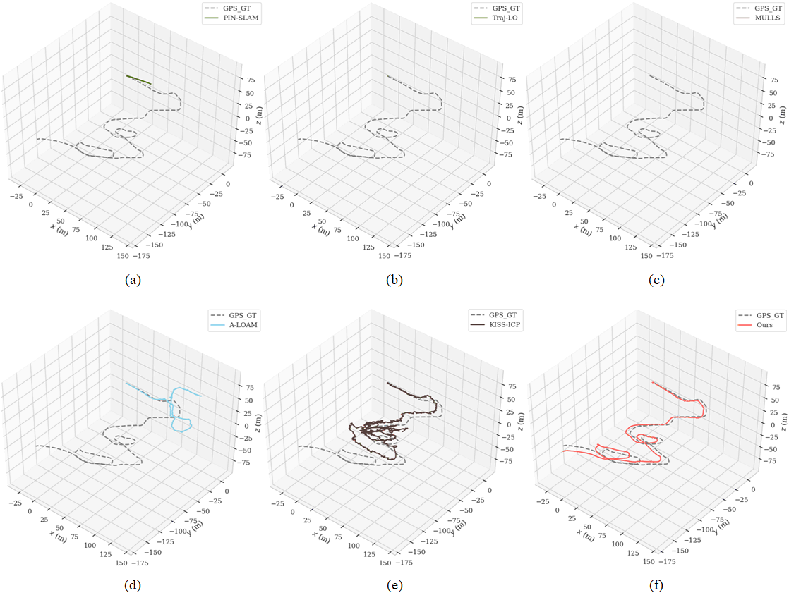

# Planetary-LiDAR-SLAM

A LiDAR SLAM framework for planetary environments, code will soon be released.

## Results on Multiple Datasets

 
<em>Overall description of the AMEDS and Erfoud datasets. (a) AMEDS, (b) Erfoud.</em>

## ARCHES Mount Etna Dataset (AMEDS)

### Trajectory Visualization

 
<em>Pose visualization on the AMEDS dataset. (a) PIN-SLAM, (b) Traj-LO, (c) MULLS, (d) A-LOAM, (e) KISS-ICP, (f) Ours.</em>

### Quantitative Results
| Method | APE Mean (m)↓ | APE Median (m)↓ | RPE Mean (m)↓ | RPE Median (m)↓ | APE/Length (%)↓ | Completeness (%)↑ |
|--------|---------------|-----------------|---------------|-----------------|-----------------|-------------------|
| PIN-SLAM | 0.01 | 0.01 | 0.02 | 0.02 | - | 13.76 |
| Traj-LO | 1.92 | 0.03 | 0.35 | 0.01 | 1.42 | 22.26 |
| MULLS | 16.59 | 0.49 | 21.79 | 0.48 | 12.30 | 22.60 |
| A-LOAM | 9.12 | 6.90 | 0.56 | 0.44 | 6.76 | 100.00 |
| KISS-ICP | 4.56 | 4.13 | 2.42 | 1.62 | 3.38 | 100.00 |
| **Ours** | **1.62** | **1.52** | **0.32** | **0.20** | **1.20** | **100.00** |

*Comparison with different SLAM state-of-the-art methods on the AMEDS dataset. The best results are marked with bold texts. Note that only methods with complete trajectories are considered for fair accuracy comparison.*

## The Erfoud Dataset

### Trajectory Visualization

 
<em>Pose visualization on the Erfoud dataset. (a) PIN-SLAM, (b) Traj-LO, (c) MULLS, (d) A-LOAM, (e) KISS-ICP, (f) Ours.</em>

### Quantitative Results
| Method | APE Mean (m)↓ | APE Median (m)↓ | RPE Mean (m)↓ | RPE Median (m)↓ | APE/Length (%)↓ | Completeness (%)↑ |
|--------|---------------|-----------------|---------------|-----------------|-----------------|-------------------|
| PIN-SLAM | 16.15 | 16.40 | 0.75 | 0.65 | 2.70 | 5.18 |
| Traj-LO | - | - | - | - | - | - |
| MULLS | - | - | - | - | - | - |
| A-LOAM | 90.40 | 85.12 | 1.89 | 0.17 | 15.14 | 100.00 |
| KISS-ICP | 29.13 | 14.75 | 2.01 | 0.49 | 4.88 | 100.00 |
| **Ours** | **9.60** | **6.63** | **0.71** | **0.04** | **1.61** | **100.00** |

*Comparison with different SLAM state-of-the-art methods on the Erfoud dataset.*
