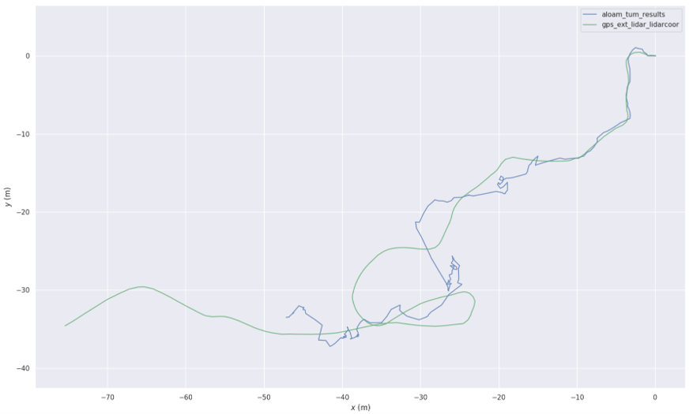
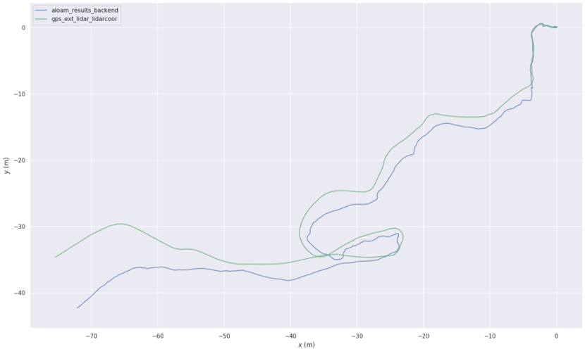
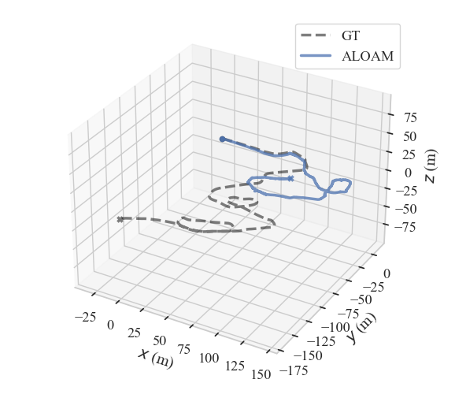
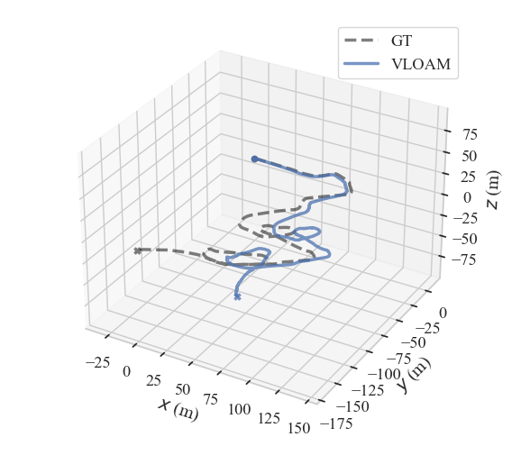
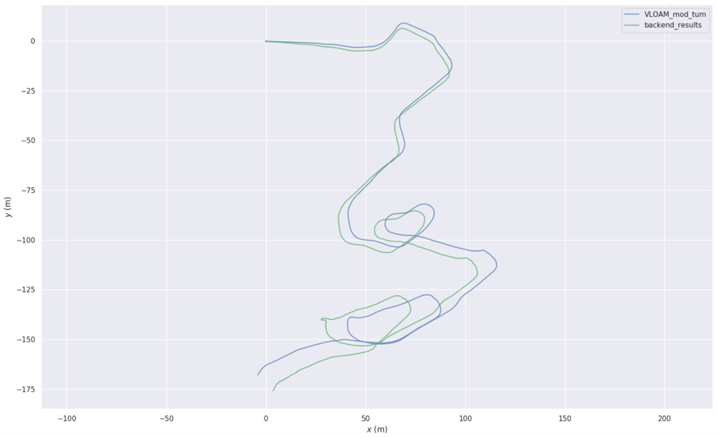

# Planetary-LiDAR-SLAM

A LiDAR SLAM framework for planetary environments, code will soon be released.

## Results on multiple datasets

### ARCHES Mount Etna Dataset (AMEDS)

#### A-LOAM

#### Proposed

### The Erfoud dataset

#### A-LOAM

#### V-LOAM

#### Proposed

